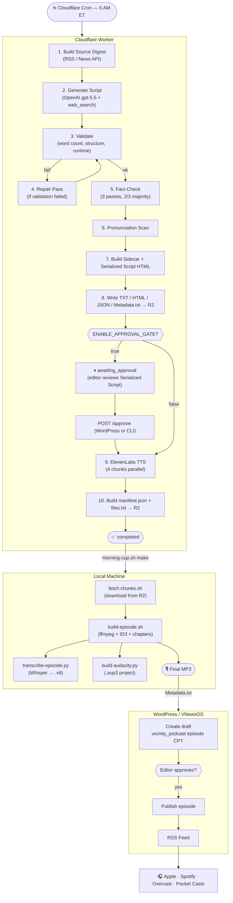

# Episode Pipeline — The Morning Cup

Complete technical reference for how a single episode moves from a 5 AM cron tick to a finished, tagged MP3 ready for publishing.

---

## Table of Contents

1. [Episode Pipeline — End to End](#1-episode-pipeline--end-to-end)
2. [Worker Components](#2-worker-components)
3. [R2 Storage Layout](#3-r2-storage-layout)
4. [Local Assembly (build-episode.sh)](#4-local-assembly-build-episodesh)
5. [Chapter Markers](#5-chapter-markers)
6. [Transcripts](#6-transcripts)
7. [Audacity Multi-Track Project](#7-audacity-multi-track-project)
8. [API Endpoints](#8-api-endpoints)
9. [Run Status Flow](#9-run-status-flow)
10. [WordPress / VNewsOS Integration](#10-wordpress--vnewsos-integration)

---

## 1. Episode Pipeline — End to End



[↑ Back to top](#table-of-contents)

---

## 2. Worker Components

### 1. Source Digest

`src/sourceDigest.ts` builds a categorized digest of yesterday's news from configured sources:

- **RSS feeds** — configured via `NEWS_RSS_FEEDS` (comma-separated URLs in `wrangler.toml`); Reuters, AP News, and similar wire services work well
- **News API** — optional; configured via `NEWSAPI_KEY` and `NEWSAPI_ENDPOINT`; returns top headlines by category

The digest is formatted as a structured summary passed directly into the OpenAI prompt as context. Stories from the last 7 days that have already been covered are excluded via the topic deduplication memory stored in KV.

---

### 2. OpenAI Script Generation

`src/openai.ts` calls the **OpenAI Responses API** using model `gpt-5.5` with `web_search_preview` enabled.

- The master prompt (`src/prompt.ts`) requests a strict JSON object conforming to the schema in `src/schema.ts`
- `web_search_preview` allows the model to verify facts and pull in details beyond the source digest
- The prompt enforces section structure, chapter titles, spacer placement, riddle format, social copy fields, and source citation requirements
- Output is parsed against the JSON schema at the API boundary; malformed responses are rejected before they reach the validator

---

### 3. Validation

`src/validator.ts` checks the generated episode JSON against these rules:

| Check | Rule |
|---|---|
| Word count (floor) | Must meet `MIN_SCRIPT_WORDS` (default: 3,300 words) |
| Word count (ceiling) | Must not exceed `MAX_SCRIPT_WORDS` (default: 3,900 words) |
| Word count (target) | Should be between `TARGET_SCRIPT_WORDS_MIN` and `TARGET_SCRIPT_WORDS_MAX` |
| Spacer count | Must have at least the minimum number of `[TEN-SECOND SECTION SPACER]` markers |
| Forbidden patterns | Must not contain "music cue", "production note", "voice description", or similar |
| Required sections | All mandatory sections (politics, economy, etc.) must be present |
| Required fields | Title, description, chapters array, source notes, riddle must all be populated |

If validation passes, the pipeline proceeds to fact-checking. If it fails, the repair pass runs.

---

### 4. Repair Pass

`src/repair.ts` handles two failure modes:

- **Standard repair** — runs when validation fails; sends the rejected episode JSON back to `gpt-5-mini` with a repair prompt listing every failed check; the model fills gaps and fixes structural problems
- **Extend pass** — runs when the repaired episode is still under the word count floor; asks the model to expand named sections that are under their target length

After each repair or extend attempt, the episode is re-validated. The pipeline retries up to the configured limit before marking the run `failed`.

---

### 5. Fact-Check

Three independent fact-check passes are run in parallel using the same Responses API. Each pass evaluates every factual claim in the script against web search results.

A **2-of-3 majority vote** determines the result for each claim. Claims that fail the majority vote are flagged. The fact-check results are included in the Sidecar JSON and the Serialized Script HTML for editorial review.

---

### 6. Pronunciation Scanner

`src/pronunciationScanner.ts` scans the approved script for proper nouns, acronyms, technical terms, and foreign words that may be mispronounced by the TTS engine.

Flagged items are written to `Pronunciation-Flags.json` in R2. The Serialized Script HTML includes the flags inline so an editor reviewing the approval gate document can catch issues before TTS runs.

---

### 7. Sidecar + Serialized Script

Two audit artifacts are built before writing to R2:

- **Sidecar.json** — a JSON record containing the fact-check results, pronunciation flags, validation results, repair history, and all metadata about the run. This is the machine-readable audit trail.
- **Serialized Script HTML** — a self-contained HTML document containing the full formatted script, inline fact-check annotations, pronunciation flags, and a summary of the run. This is the human-readable review document shown to editors when `ENABLE_APPROVAL_GATE=true`.

The serialized script filename includes a serial number and the generation date: `The Morning Cup - YYYY-MM-DD - Serialized Script-{serial}-{YYYYMMDD}.html`. Once written, this file is never modified.

---

### 8. Write to R2 (TXT / HTML / JSON / Metadata.txt)

Before TTS begins, all script files and metadata are written to R2 under `Generators/Podcasts/TheMorningCup/YYYY-MM-DD/`:

- Plain text script (`.txt`)
- HTML-rendered script (`.html`)
- Full episode JSON (`.json`)
- Metadata.txt (the import document for WordPress)
- Serialized Script HTML
- Sidecar JSON
- Pronunciation Flags JSON
- `run.json` (run status record, updated throughout the pipeline)

---

### 9. ElevenLabs TTS

`src/elevenlabs.ts` sends the TTS-ready script to ElevenLabs using the configured voice and settings.

- The script is split into chunks by `src/chunker.ts` at `[TEN-SECOND SECTION SPACER]` markers
- Short segments (under 600 characters) are merged into the preceding chunk
- Long segments (over `MAX_TTS_CHARS_PER_CHUNK`, default 2,500 characters) are split at sentence boundaries
- **4 chunks are synthesized in parallel** to minimize total TTS time
- 429 rate-limit responses are automatically retried with exponential backoff, honoring `retry-after` headers
- Each chunk MP3 is written to R2 under `chunks/` in 3-digit zero-padded order

---

### 10. Manifest + files.txt

After all chunks are written, `src/manifest.ts` builds:

- **manifest.json** — contains episode title, publisher, copyright, runtime, word count, chapters array with titles and start times, and per-chunk metadata including `starts_section_indices`
- **files.txt** — an ffmpeg-compatible concat list referencing the chunk filenames in playback order

Both are written to R2 alongside the chunks.

[↑ Back to top](#table-of-contents)

---

## 3. R2 Storage Layout

All episode files are stored in the `vicinity` R2 bucket under this key structure:

```
Generators/Podcasts/TheMorningCup/
└── YYYY-MM-DD/
    ├── The Morning Cup - YYYY-MM-DD.txt
    ├── The Morning Cup - YYYY-MM-DD.html
    ├── The Morning Cup - YYYY-MM-DD.json
    ├── The Morning Cup - YYYY-MM-DD - Metadata.txt
    ├── The Morning Cup - YYYY-MM-DD - manifest.json
    ├── The Morning Cup - YYYY-MM-DD - files.txt
    ├── The Morning Cup - YYYY-MM-DD - Serialized Script-{serial}-{YYYYMMDD}.html
    ├── The Morning Cup - YYYY-MM-DD - Sidecar.json
    ├── The Morning Cup - YYYY-MM-DD - Pronunciation-Flags.json
    ├── run.json
    └── chunks/
        ├── The Morning Cup - YYYY-MM-DD - 001.mp3
        ├── The Morning Cup - YYYY-MM-DD - 002.mp3
        └── ... (typically 10–14 chunks)
```

To browse in the Cloudflare dashboard:

```
https://dash.cloudflare.com/<account-id>/r2/default/buckets/vicinity/objects?prefix=Generators%2FPodcasts%2FTheMorningCup%2F
```

To download a file via Wrangler:

```bash
DATE=2026-05-24
npx wrangler r2 object get \
  "vicinity/Generators/Podcasts/TheMorningCup/$DATE/The Morning Cup - $DATE.txt" \
  --file ~/Downloads/episode.txt --remote
```

[↑ Back to top](#table-of-contents)

---

## 4. Local Assembly (build-episode.sh)

`scripts/build-episode.sh` takes the downloaded chunks and sound assets and produces the final broadcast-ready MP3.

### Audio concatenation order

```
1.  Hello.mp3                    ← intro music bed
2.  Coffee Pour.wav              ← signature pour SFX (faded)
3.  intro-sting.wav              ← "now the news begins" sting (optional, skipped if missing)
4.  chunk-001.mp3                ← first news section
5.  Topic Transition.mp3         ← section sting (only before new sections, not continuation chunks)
6.  chunk-002.mp3
7.  Topic Transition.mp3
…
N.  chunk-NNN.mp3
N+1 Goodbye.mp3                  ← outro music bed
```

Section stings are inserted only before chunks whose `starts_section_indices` in the manifest is non-empty. Continuation chunks (from a long section that was split across multiple TTS chunks) do not get a sting.

If `Podcast Background.mp3` is present in `Sounds/`, it is mixed under the entire narration at **10% volume** throughout the episode.

### Processing steps

1. **Normalize** — every input clip (mixed WAV + MP3 at varying sample rates) is normalized to MP3 44.1 kHz stereo 192 kbps in a temp directory. This is required because ffmpeg's concat demuxer requires identical codec, sample rate, and channel layout across all inputs.
2. **Concatenate** — all normalized clips are joined with ffmpeg's concat demuxer using `-c copy` (no re-encode of the concatenated output).
3. **Loudness normalize** — a second ffmpeg pass runs `loudnorm=I=-16:TP=-1.5:LRA=11` to normalize the assembled episode to **-16 LUFS** (EBU R128 broadcast standard), true peak -1.5 dBFS.
4. **ID3 tags** — written inline from the manifest (see table below).
5. **Chapter markers** — `write-chapters.py` is called to embed CTOC + CHAP atoms.

### ID3 tags written

| ID3 frame | Source | Example |
|---|---|---|
| `TIT2` (title) | `manifest.title` | `The Morning Cup: Rates, AI Rules & Your Riddle` |
| `TPE1` (artist) | `manifest.publisher` | `Fold 42` |
| `TALB` (album) | `manifest.show_name` | `The Morning Cup` |
| `TYER` / `TDRC` (year/date) | episode date | `2026` / `2026-05-24` |
| `TCOP` (copyright) | `manifest.copyright` | `Copyright 2026 — Fold 42` |
| `TCON` (genre) | `manifest.genre` | `News` |
| `TPUB` (publisher) | `manifest.publisher` | `Fold 42` |
| `COMM` (comment) | runtime + word count | `Generated 2026-05-24T11:20:41Z — ~23.5 min / 3412 words` |
| `TRCK` (track) | day of year | `144` (episode number) |
| `TPOS` (disc) | year | `2026` (season) |

[↑ Back to top](#table-of-contents)

---

## 5. Chapter Markers

Every assembled episode has **MP3 ID3 chapter markers** embedded directly in the file. Podcast clients display them as a clickable section list.

### How they work

Two ID3v2 frame types are written by `scripts/write-chapters.py`:

- **CHAP** — one per chapter; carries the chapter's element ID, start time (ms), end time (ms), and a `TIT2` sub-frame with the title
- **CTOC** — the table of contents listing all chapter element IDs in order with `TOP_LEVEL` and `ORDERED` flags

### How chapter timings are calculated

1. `manifest.json` contains a `chapters[]` array with one title per spacer-separated section of the script, and a `chunks[]` array with per-chunk `starts_section_indices`
2. `write-chapters.py` measures the duration of every audio clip (intro, pour, sting, each chunk, section stings, outro) using `ffprobe`
3. It walks the assembled timeline and computes each chapter's start time in milliseconds based on the cumulative duration up to the chunk where that section begins
4. Chapters are written to the assembled MP3 via `mutagen`, removing any prior chapters first so re-runs do not duplicate markers

### Supported players

| Player | Chapter support |
|---|---|
| Apple Podcasts | Full chapter UI, no configuration needed |
| Overcast | First-class chapter support since launch |
| Pocket Casts | Reads embedded chapters |
| Castro | Reads embedded chapters |
| Spotify | Reads embedded (since 2024) |
| Buzzsprout, Captivate, Transistor, Podbean, Castos, Simplecast, RedCircle | All read embedded chapters |

### Verifying chapters

```bash
DATE=2026-05-24
ffprobe -v error -show_chapters -of json \
  ~/Documents/"The Morning Cup"/Episodes/"The Morning Cup - $DATE.mp3" \
  | python3 -m json.tool | head -60
```

[↑ Back to top](#table-of-contents)

---

## 6. Transcripts

### How Whisper transcription works

`scripts/transcribe-episode.py` sends the final assembled MP3 to the OpenAI Whisper API and writes a timestamped transcript.

- **Input:** `~/Documents/The Morning Cup/Episodes/The Morning Cup - YYYY-MM-DD.mp3`
- **Output:** `~/Documents/The Morning Cup/Episodes/The Morning Cup - YYYY-MM-DD.vtt`
- **Requires:** `OPENAI_API_KEY` in `~/Documents/The Morning Cup/.env`

The transcript covers only the spoken narration — intro/outro music, the coffee pour, stings, and background music are not transcribed.

### Uses for the transcript

- Import to YouTube (auto-detects `.vtt` format for caption tracks)
- Upload to WordPress or your podcast host as show notes / caption file
- Paste into Claude for research, quote extraction, or alternate social copy

### Running transcription manually

```bash
cd ~/Documents/"The Morning Cup"/Generator
./scripts/morning-cup.sh transcribe 2026-05-24
```

If a `.vtt` file already exists for the date, the script skips and prints "Transcripts already exist." Delete the file to force a re-transcription.

### Searching transcripts

```bash
# Search one episode
grep -in "housing" ~/Documents/"The Morning Cup"/Episodes/"The Morning Cup - 2026-05-24.vtt"

# Search across all downloaded transcripts
grep -irn "ceasefire" ~/Documents/"The Morning Cup"/Episodes/
```

[↑ Back to top](#table-of-contents)

---

## 7. Audacity Multi-Track Project

`scripts/build-audacity.py` generates a multi-track Audacity `.aup3` project file from the assembled episode and its chunk/sound components.

### Track layout

| Track color | Contents |
|---|---|
| GREEN | Intro music (Hello.mp3) and Outro music (Goodbye.mp3) |
| ORANGE | SFX and stings (Coffee Pour.wav, intro-sting.wav, Topic Transition.mp3) |
| BLUE | TTS narration chunks (one track per chunk) |
| YELLOW | Background music (Podcast Background.mp3, if present) |

A **Labels** track is also created showing each chapter title at its correct timestamp, making it easy to navigate to any section during editing.

### Requirements

- **Audacity 3.x** — download from [audacityteam.org](https://www.audacityteam.org/)
- **FFmpeg library for Audacity** — required to import MP3 files; install from [support.audacityteam.org/basics/installing-ffmpeg](https://support.audacityteam.org/basics/installing-ffmpeg)
- **Python `numpy`** — required for build-audacity.py: `pip install --user numpy`

### Running Audacity build manually

```bash
cd ~/Documents/"The Morning Cup"/Generator
./scripts/morning-cup.sh audacity 2026-05-24
```

Output: `~/Documents/The Morning Cup/Episodes/The Morning Cup - 2026-05-24.aup3`

[↑ Back to top](#table-of-contents)

---

## 8. API Endpoints

All endpoints are served by the deployed Cloudflare Worker.

| Method | Path | Auth | Description |
|---|---|---|---|
| GET | `/health` | None | Health check; always public; returns 200 OK |
| GET | `/status?date=YYYY-MM-DD` | Optional (Bearer) | Returns the run record JSON for the given date; auth required unless `STATUS_PUBLIC=true` |
| POST | `/run?date=YYYY-MM-DD&force=true` | Bearer | Triggers episode generation for the given date; `force=true` re-generates even if already completed |
| POST | `/approve?date=YYYY-MM-DD` | Bearer | Approves the script for the given date and starts TTS; only valid when status is `awaiting_approval` |
| POST | `/reject?date=YYYY-MM-DD` | Bearer | Rejects the script for the given date and sets status to `failed`; use `POST /run?force=true` to regenerate |

**Authentication:** all protected endpoints require `Authorization: Bearer <RUN_SECRET>` where `RUN_SECRET` matches the Cloudflare secret of the same name.

**Example: health check**

```bash
curl https://themorningcupgenerator.itsmiarosemathews.workers.dev/health
```

**Example: check status**

```bash
curl -H "Authorization: Bearer $RUN_SECRET" \
  "https://themorningcupgenerator.itsmiarosemathews.workers.dev/status?date=2026-05-24"
```

**Example: trigger run**

```bash
curl -X POST \
  -H "Authorization: Bearer $RUN_SECRET" \
  "https://themorningcupgenerator.itsmiarosemathews.workers.dev/run?date=2026-05-24&force=true"
```

[↑ Back to top](#table-of-contents)

---

## 9. Run Status Flow

The `status` field in `run.json` (stored in KV and R2) progresses through these stages:

| Stage | Description |
|---|---|
| `pending` | Run record created; Worker is about to start generation |
| `generating` | OpenAI Responses API call in progress; web_search active |
| `validating` | Validator checking word count, structure, required fields |
| `awaiting_approval` | Script passed validation and fact-check; paused for editorial review (only when `ENABLE_APPROVAL_GATE=true`) |
| `approved` | Editor approved via `/approve`; TTS is about to start |
| `tts` | ElevenLabs rendering chunks in parallel |
| `completed` | All chunks written to R2; manifest and files.txt built; pipeline done |
| `failed` | An unrecoverable error occurred; details in `run.json`; re-run with `--force` |

Transitions flow in the order listed above. A run cannot move backwards. A `failed` run can only be restarted by triggering a new run with `force=true`, which creates a fresh run record for the same date.

[↑ Back to top](#table-of-contents)

---

## 10. WordPress / VNewsOS Integration

### When does WordPress get involved?

After `status = completed`, the Metadata.txt written to R2 contains everything needed to create and publish a `vicinity_podcast` episode CPT entry in WordPress / VNewsOS.

### Metadata.txt

`The Morning Cup - YYYY-MM-DD - Metadata.txt` is the import document written to R2 at the end of the pipeline. It contains all fields needed for the CPT draft.

**Sample content:**

```
THE MORNING CUP — EPISODE METADATA

Post Title:      Rates, AI Rules & Your Sunday Riddle
Feed Title:      The Morning Cup: Rates, AI Rules & Your Sunday Riddle
Episode:         144  (Season 2026)
Date:            2026-05-24  —  May 24th, 2026
Host:            Penelope Rose
Publisher:       Fold 42
Runtime:         ~23.5 min  (3412 words)
Copyright:       Copyright 2026 — Fold 42
Genre:           News

-- WordPress / VNewsOS --
SEO Title:       Ep. 144: Rates, AI Rules & Your Riddle | The Morning Cup
SEO Description: Start your morning with The Morning Cup — today Penelope covers...
Tags:            The Morning Cup, Fold 42, daily news, morning briefing, interest rates, AI regulation, ...

-- Audio --
_vicinity_audio_url:      https://cdn.fold42.com/audio/2026/05/the-morning-cup-2026-05-24.mp3
_vnews_ep_audio_url:      https://cdn.vicinitynews.com/audio/2026/05/the-morning-cup-2026-05-24.mp3

-- Content --
[3 title options]
[full 2-3 paragraph episode description]
[chapter list]
[show notes / sources with URLs]
[riddle Q+A]
[social media copy]
```

### Automatic CPT draft creation

VNewsOS polls `GET /status` or receives a webhook on `status = completed`. On completion, it reads `Metadata.txt` from R2 and creates a draft `vicinity_podcast` episode CPT entry populated with all fields.

### Audio URLs

Two audio URL fields are written to the CPT meta:

- `_vicinity_audio_url` — points to `cdn.fold42.com`; this is the primary URL used by VNewsOS and the RSS feed
- `_vnews_ep_audio_url` — points to `cdn.vicinitynews.com`; legacy URL for backwards compatibility with older player embeds

### Approval validation

If `ENABLE_APPROVAL_GATE=true`, VNewsOS verifies that `approved_at` is populated in the run record before allowing the CPT entry to be published. Episodes generated without approval gate can be published immediately.

### The /approve REST call from WordPress

When an editor approves from within the VNewsOS editorial interface, WordPress sends:

```
POST /approve?date=YYYY-MM-DD
Authorization: Bearer <RUN_SECRET>
Content-Type: application/json

{
  "approver_name": "Penelope Rose",
  "approver_serial": "42",
  "approval_notes": "Approved — fact-check passed, no pronunciation issues"
}
```

The Worker records `approver_name`, `approver_serial`, `approval_notes`, and `approved_at` (UTC timestamp) in the run record, then immediately starts TTS.

### Publish flow

1. Worker writes `Metadata.txt` to R2 on completion
2. VNewsOS detects completion (poll or webhook) and creates a `vicinity_podcast` draft with all CPT fields populated
3. The local `morning-cup.sh make` command assembles the final MP3 locally
4. The editor reviews the draft in VNewsOS, verifies the audio plays, and clicks **Publish**
5. The RSS feed updates; Apple Podcasts, Spotify, Overcast, and Pocket Casts pick up the new episode within their normal refresh interval

[↑ Back to top](#table-of-contents)
