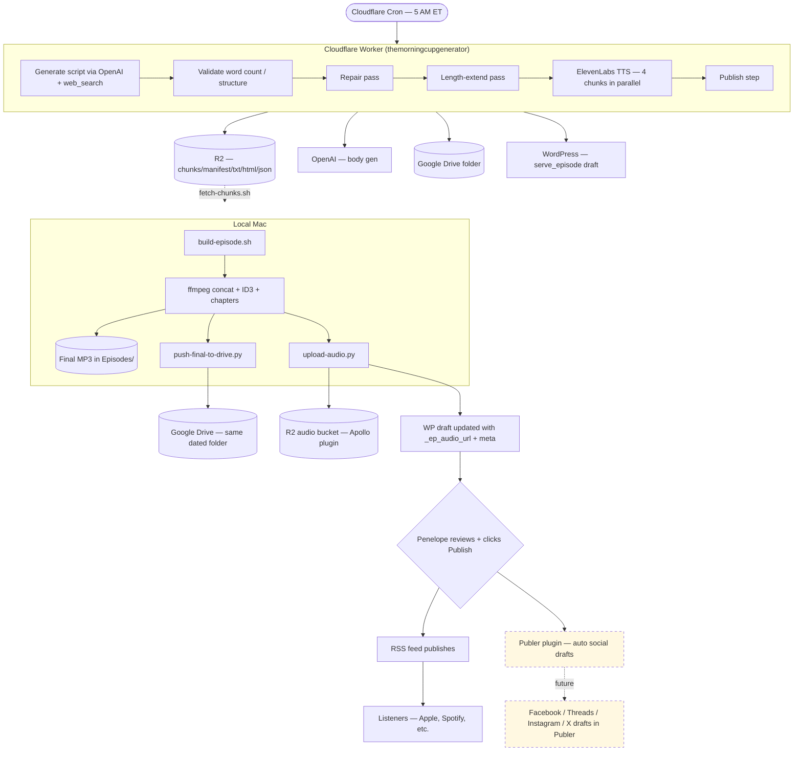
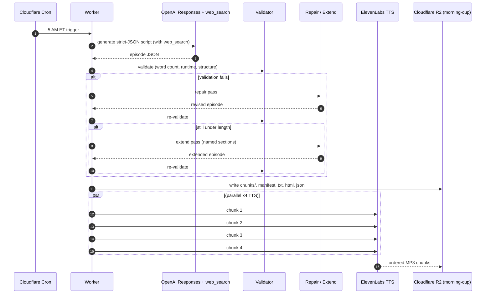
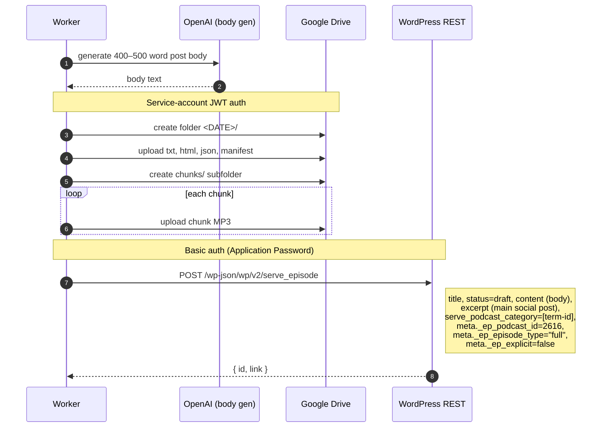
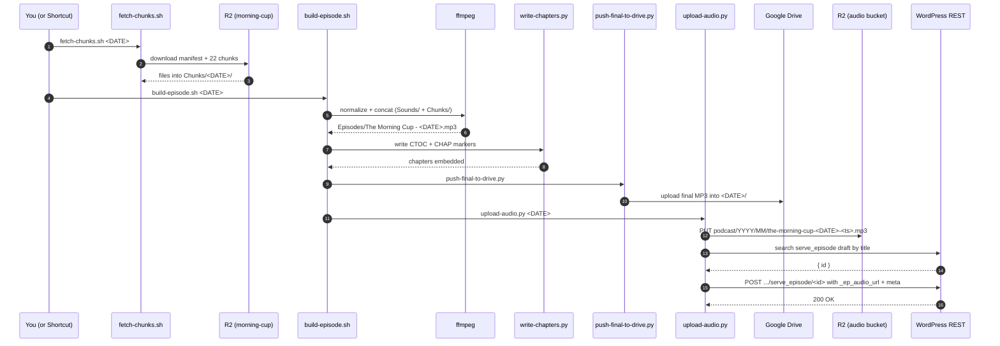
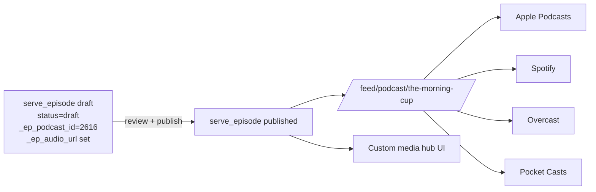
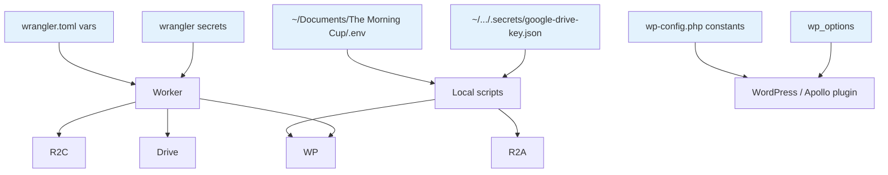
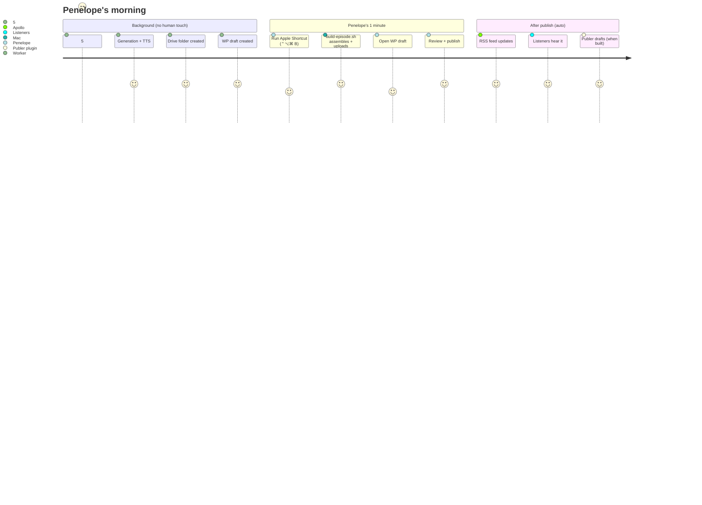
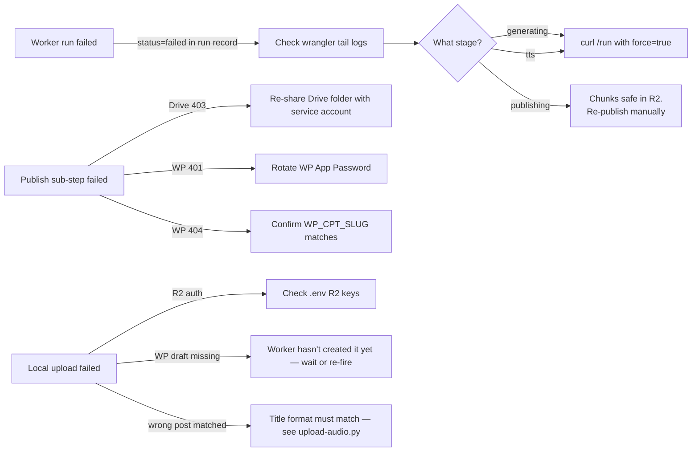

# The Morning Cup — Full Pipeline

End-to-end picture of how a single episode goes from "5 AM cron tick" to
"published on the website" with zero human touch other than a final review
click. Components below the dotted line in the architecture diagram are
planned but not built yet — see the bottom of this doc for status.

> **PDF version:** mermaid diagrams render natively on GitHub. To export
> this page as a PDF, open it on GitHub and use your browser's *File →
> Print → Save as PDF*. For a polished PDF with mermaid baked in:
>
> ```bash
> # On macOS:
> brew install pandoc librsvg basictex
> # Cache fonts:
> sudo tlmgr install collection-fontsrecommended
> # Render:
> pandoc docs/PIPELINE.md -o pipeline.pdf \
>   --pdf-engine=xelatex \
>   --filter=mermaid-filter
> ```

---

## High-level architecture



---

## Component breakdown

### 1. Cloudflare Worker — content generation

Runs once daily at 5:00 AM `America/New_York`. The cron handler in
`src/index.ts:scheduled` ticks every UTC hour 9–11 and fires only when
the local hour is 5 (handles DST automatically).



**Output to R2** under `morning-cup/<DATE>/`:
- `chunks/001.mp3 … NNN.mp3`
- `The Morning Cup - <DATE>.txt` (clean script for show notes)
- `The Morning Cup - <DATE>.html`
- `The Morning Cup - <DATE>.json` (full episode object including chapters)
- `The Morning Cup - <DATE> - manifest.json` (canonical metadata)
- `run.json` (run state record)

### 2. Cloudflare Worker — publish step

Immediately after a successful run, the worker pushes artifacts out and
creates a WordPress draft. All sub-steps are best-effort; a failure here
does NOT fail the worker run.



### 3. Local Mac — assembly and upload

You (or the daily Apple Shortcut) runs the local pipeline after the
worker finishes. ~30 seconds of human time.



### 4. WordPress — Apollo plugin



The post type `serve_episode` is registered by the Apollo plugin with
these meta fields exposed to the REST API:

| Meta key | Set by | Value |
|----------|--------|-------|
| `_ep_podcast_id` | Worker | `2616` (parent serve_podcast: The Morning Cup) |
| `_ep_episode_type` | Worker | `"full"` |
| `_ep_explicit` | Worker | `false` |
| `_ep_audio_url` | Local upload-audio.py | `https://serve.pennycdn.com/podcast/2026/05/...mp3` |
| `_ep_audio_r2_key` | Local upload-audio.py | `podcast/2026/05/the-morning-cup-2026-05-01-…mp3` |
| `_ep_file_size` | Local upload-audio.py | bytes |
| `_ep_mime_type` | Local upload-audio.py | `audio/mpeg` |
| `_ep_duration_sec` | Local upload-audio.py | seconds (ffprobe) |
| `_ep_duration` | Local upload-audio.py | `MM:SS` or `HH:MM:SS` |

### 5. Future — Publer auto social drafts

A separate plugin (`tpt-publer-auto-social-drafts`) hooks the
`transition_post_status` action. When a `serve_episode` is published, it
schedules a WP-Cron job that:

1. Generates a [Short.io](https://short.io) link from the permalink (or
   the configured Podcast Landing Page URL for podcast post types).
2. Calls OpenAI / Gemini to produce platform-specific copy (Facebook,
   Threads, Instagram, X) with hashtags, topic suggestions, etc.
3. Creates **draft** posts in Publer for each enabled platform — both a
   main post and a link-focused follow-up.
4. Saves Publer job IDs back to post meta for de-duplication.

Status: **specced, not built.** When ready, will live as its own GitHub
repo + WP plugin so other Penny Tribune post types (articles, videos,
elections) get the same treatment.

---

## Configuration map



### Worker side (`wrangler.toml` + `wrangler secret put`)

| Variable | Type | Purpose |
|----------|------|---------|
| `OPENAI_MODEL` | var | Currently `gpt-5-mini` |
| `WORKER_TIMEZONE` | var | `America/New_York` |
| `MIN_SCRIPT_WORDS` / `TARGET_*` | var | Validator thresholds |
| `MAX_TTS_CHARS_PER_CHUNK` | var | ElevenLabs chunking limit |
| `ENABLE_PUBLISHING` | var | `true` to push Drive + create WP drafts |
| `GOOGLE_DRIVE_FOLDER_ID` | var | Shared destination folder ID |
| `WP_URL` / `WP_USERNAME` | var | WordPress endpoint + login |
| `WP_CPT_SLUG` | var | `serve_episode` |
| `WP_PODCAST_SHOW_TAXONOMY` | var | `serve_podcast_category` |
| `WP_PODCAST_SHOW_TERM` | var | `The Morning Cup` |
| `WP_PARENT_PODCAST_ID` | var | `2616` |
| `HOST_NAME` | var | `Penelope Rose` |
| `PUBLISHER` / `COPYRIGHT_HOLDER` | var | ID3 metadata defaults |
| **secret** `OPENAI_API_KEY` | secret | OpenAI auth |
| **secret** `ELEVENLABS_API_KEY` / `ELEVENLABS_VOICE_ID` | secret | TTS auth |
| **secret** `GOOGLE_SERVICE_ACCOUNT_KEY` | secret | Drive auth (full JSON) |
| **secret** `WP_APP_PASSWORD` | secret | WordPress draft creation |
| **secret** `RUN_SECRET` | secret | Gates `POST /run` |

### Local side (`~/Documents/The Morning Cup/.env`)

| Variable | Purpose |
|----------|---------|
| `RUN_SECRET` | Same value as Cloudflare; used by `morning-cup.sh` to fire the worker manually |
| `GOOGLE_DRIVE_FOLDER_ID` | Same value as Cloudflare; used by `push-final-to-drive.py` |
| `GOOGLE_DRIVE_KEY_PATH` | Path to the service-account JSON locally |
| `R2_ACCOUNT_ID` | Cloudflare account ID for R2 audio bucket |
| `R2_AUDIO_ACCESS_KEY_ID` | R2 access key with PutObject on the audio bucket |
| `R2_AUDIO_SECRET_ACCESS_KEY` | matching secret |
| `R2_AUDIO_BUCKET` | Audio R2 bucket name (the one the Apollo plugin reads) |
| `R2_AUDIO_PUBLIC_URL` | e.g. `https://serve.pennycdn.com` |
| `WP_URL` | `https://thepennytribune.com` |
| `WP_USERNAME` | `systems` |
| `WP_APP_PASSWORD` | Application Password (same value as the worker secret) |

---

## Daily ops flow (the actual human routine)



---

## Failure modes + recovery



Detailed troubleshooting matrix: [TROUBLESHOOTING.md](./TROUBLESHOOTING.md).

---

## Cost summary

| Line | Per run | Per month (daily) |
|------|---------|-------------------|
| OpenAI (gpt-5-mini, ~7k in / 6k out) | ~$0.05 | ~$1.50 |
| OpenAI web_search (8–15 calls) | ~$0.30–0.50 | ~$10–15 |
| OpenAI body gen | ~$0.01 | ~$0.30 |
| ElevenLabs TTS (~22k chars) | depends on plan | $22–99 base + overage |
| Cloudflare Workers + R2 + KV | ~$0 | <$1 |
| Google Drive API | $0 | $0 |
| WordPress REST | $0 | $0 |
| **Total compute** | | **~$30–115** |
| Publer subscription (when added) | — | $9–24 |
| Short.io subscription (when added) | — | $0–20 |

ElevenLabs is the dominant variable. At Pro tier (`$99/mo`, 500k chars
included) you'll be slightly under or just over depending on episode
length.
